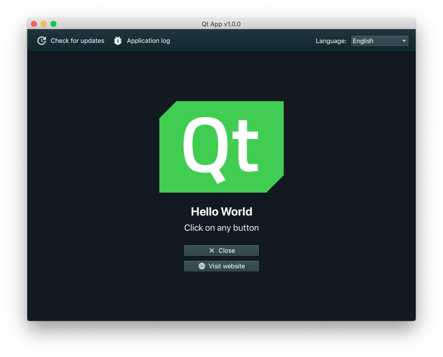

# Qt App Template

A simple template for Qt apps with the following features:

- Code for displaying a QtQuick [`ApplicationWindow`](https://doc.qt.io/qt-5/qml-qtquick-controls2-applicationwindow.html).
- Automated [builds & artifact upload](https://github.com/alex-spataru/QtApp-Template/actions) for Windows, macOS & GNU/Linux.
- Comes with [issue templates](https://github.com/alex-spataru/QtApp-Template/issues/new/choose).
- [Code of conduct](CODE_OF_CONDUCT.md) file.
- Translation [template](assets/translations) files & [code](src/Misc/Translator.h).
- Deploy configuration for [Windows](deploy/windows), [macOS](deploy/macOS) & [GNU/Linux](deploy/linux).
- [NSIS installer](deploy/windows/nsis/setup.nsi) for Windows.
- [OpenSSL](https://github.com/alex-spataru/QtApp-Template/tree/master/deploy/windows) bundled for the NSIS installer.
- Save window size, position & maximize status automatically.
- [Utilities](src/Misc/Utilities.h) class.
- Display CLI output data on Windows if the application is called from the command line.
- Load [`UI.qml`](assets/qml/UI.qml) asynchronously (to keep [`main.qml`](assets/qml/main.qml) small).
- Integration with [QSimpleUpdater](https://github.com/alex-spataru/QSimpleUpdater) & modified [CuteLogger](https://github.com/alex-spataru/CuteLogger).
- `clang-format` integration.
- `.gitignore` file for Qt projects

I made this repo to stop wasting time when I need to create a new project, it may or may not be updated frequently. If this project helped you, star this repository to make it more visible to other Qt developers. Contributions welcome :)

## Screenshot of UI & features

## Automated build & deployment with GitHub actions

This projects uses [GitHub actions](https://github.com/features/actions) to automatically build & deploy binaries/installers for all major desktop platforms (Windows, macOS & GNU/Linux). The deployed files are:

- For Windows, we compile a 64-bit app with MSVC 2019 & create a [NSIS](http://nsis.sourceforge.io) installer, VC redistributable is automatically added & executed by the installer.
- For GNU/Linux, we generate an [AppImage](http://appimage.org).
- For macOS, we create & ZIP an application bundle.
- OpenSSL for Windows 64-bit with MSVC 2019.

For more information, check the [`Build.yml`](.github/workflows/Build.yml) file.

## Cloning

This repository makes use of [`git submodule`](https://git-scm.com/book/en/v2/Git-Tools-Submodules). In order to clone it, execute these commands on your Terminal:

	git clone https://github.com/alex-spataru/QtApp-Template
	cd QtApp-Template
	git submodule init
	git submodule update
	
Alternatively, just run:

	git clone --recursive https://github.com/alex-spataru/QtApp-Template

## Modifying this project to suit your needs

1. Clone/download this repo.
2. Remove my email & add yours in the [`CODE_OF_CONDUCT.md`](CODE_OF_CONDUCT.md) file (I don't want to deal with your toxic users).
3. Change to your preferred license (mine's is [MIT](https://opensource.org/licenses/MIT)).
4. Rename the [`QtApp.pro`](QtApp.pro) file & change `TARGET` value.
5. Modify contents of [`AppInfo.h`](https://github.com/alex-spataru/QtApp-Template/blob/master/src/AppInfo.h).
6. Change [`info.plist`](deploy/macOS/info.plist).
7. Rename & change [`qt-app.desktop`](deploy/linux/qt-app.desktop).
8. Change [`setup.nsi`](deploy/windows/nsis/setup.nsi).
9. Modify env. variables of [`Build.yml`](.github/workflows/Build.yml).
10. Hack on...

## Default licence

This repository is comes by default with the [MIT License](LICENSE.md). You can change it for your own needs, I won't hold a grudge against you if you need a proprietary license.
